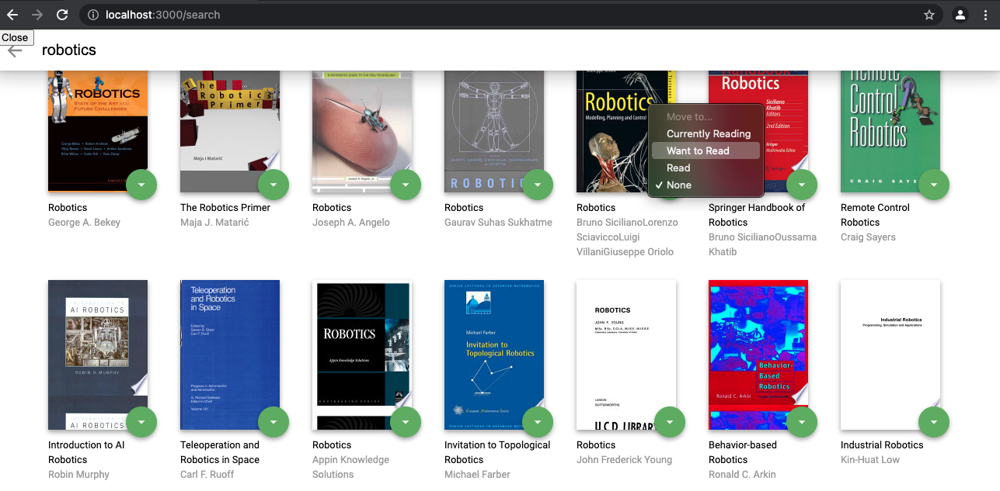

# MyReads Project

The MyReads project aims to create a bookshelf app that allows users to select and categorize books they have read, are
currently reading, or want to read. The project has to be implemented using React.

## TL;DR

To start the app right away:

* clone the repo `git clone https://github.com/miharothl/reactnd.git && cd project1-myreads`
* install all project dependencies with `npm install`
* start the development server with `npm start`

## How To Use

Navigate to [http://localhost:3000](http://localhost:3000)

MyReads shows three bookshelves:

* Currently Reading
* Want to Read
* Read

To change the bookshelf, click on the green dropdown button on the book and select desired shelf or none if you wish to
remove the book from the library.

You can add additional books to the library using the search tool (+) at the bottom right of the page.

You can search for new books using the following search terms. To add books to the library, use the green dropdown
button.

### Search Terms

'Android', 'Art', 'Artificial Intelligence', 'Astronomy', 'Austen', 'Baseball', 'Basketball', 'Bhagat', 'Biography', '
Brief', 'Business', 'Camus', 'Cervantes', 'Christie', 'Classics', 'Comics', 'Cook', 'Cricket', 'Cycling', 'Desai', '
Design', 'Development', 'Digital Marketing', 'Drama', 'Drawing', 'Dumas', 'Education', 'Everything', 'Fantasy', '
Film', 'Finance', 'First', 'Fitness', 'Football', 'Future', 'Games', 'Gandhi', 'Homer', 'Horror', 'Hugo', 'Ibsen', '
Journey', 'Kafka', 'King', 'Lahiri', 'Larsson', 'Learn', 'Literary Fiction', 'Make', 'Manage', 'Marquez', 'Money', '
Mystery', 'Negotiate', 'Painting', 'Philosophy', 'Photography', 'Poetry', 'Production', 'Programming', 'React', '
Redux', 'River', 'Robotics', 'Rowling', 'Satire', 'Science Fiction', 'Shakespeare', 'Singh', 'Swimming', 'Tale', '
Thrun', 'Time', 'Tolstoy', 'Travel', 'Ultimate', 'Virtual Reality', 'Web Development', 'iOS'

## Resources

* [Udacity Starter Template](https://github.com/udacity/reactnd-project-myreads-starter)
* [Udacity HTML Style Guide](http://udacity.github.io/frontend-nanodegree-styleguide/index.html)
* [CSS Style Guide](http://udacity.github.io/frontend-nanodegree-styleguide/css.html)
* [JavaScript Stype Guide](http://udacity.github.io/frontend-nanodegree-styleguide/javascript.html)
* [Git Stype Guide](https://udacity.github.io/git-styleguide/)
