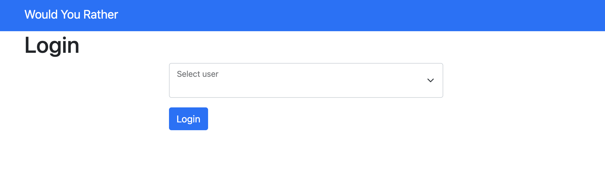
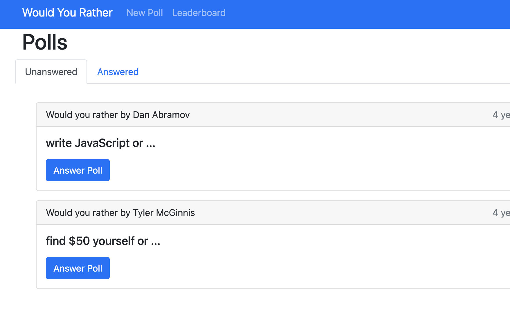
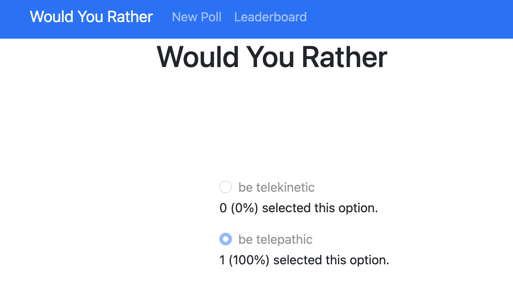
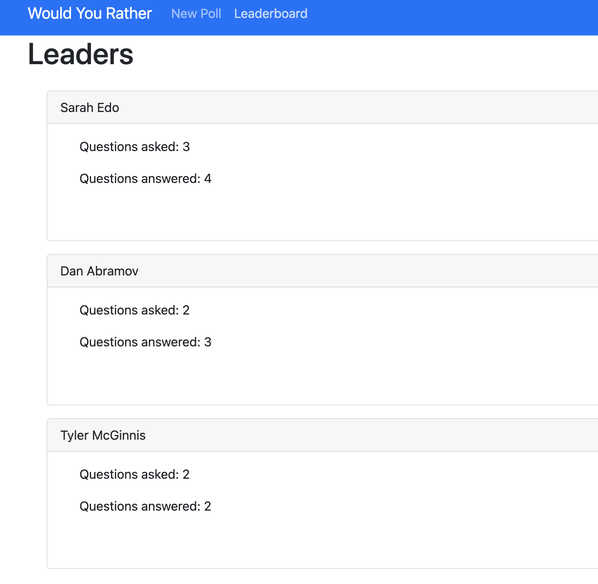

# Would You Rather?

The "Would You Rather"? is the final project of the Udacity React Nanodegree program.

The goal is to build a web app that lets users play the "Would You Rather?" game. The game goes like this: A user is asked a question in the form: "Would you rather [option A] or [option B] ?". Answering "neither" or "both" is against the rules.

## TL;DR

To start the app right away:

* clone the repo `git clone https://github.com/miharothl/und-react.git && cd project2-would-you-rather/would-you-rather`
* install all project dependencies with `npm install`
* start the development server with `npm start`

## How To Use

Navigate to [http://localhost:3000](http://localhost:3000)

First, you have to log in to the web app by choosing between three preset users.

In the home view, you can see the answered or unanswered polls for a logged-in user.

Users can answer the poll and observe the poll results.

To earn extra points, users can create a new poll.

The leaderboard shows current winners based on the total points they achieved, the sum of polls created and answered.

## Resources

* [Udacity Starter Template](https://github.com/udacity/reactnd-project-would-you-rather-starter)
* [Udacity HTML Style Guide](http://udacity.github.io/frontend-nanodegree-styleguide/index.html)
* [CSS Style Guide](http://udacity.github.io/frontend-nanodegree-styleguide/css.html)
* [JavaScript Stype Guide](http://udacity.github.io/frontend-nanodegree-styleguide/javascript.html)
* [Git Stype Guide](https://udacity.github.io/git-styleguide/)
